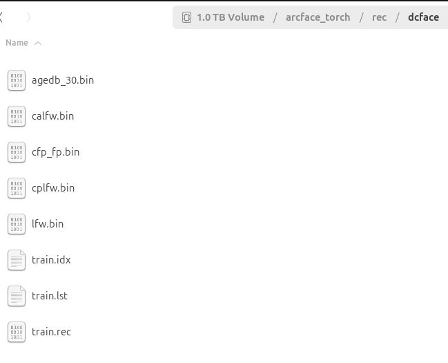

# Distributed Arcface Training in Pytorch

The "arcface_torch" repository is the official implementation of the ArcFace algorithm. It supports distributed and sparse training with multiple distributed training examples, including several memory-saving techniques such as mixed precision training and gradient checkpointing. It also supports training for ViT models and datasets including WebFace42M and Glint360K, two of the largest open-source datasets. Additionally, the repository comes with a built-in tool for converting to ONNX format, making it easy to submit to MFR evaluation systems.

## Requirements

To avail the latest features of PyTorch, we have upgraded to version 1.12.0.

- Install [PyTorch](https://pytorch.org/get-started/previous-versions/) (torch>=1.12.0).
- (Optional) Install [DALI](https://docs.nvidia.com/deeplearning/dali/user-guide/docs/), our doc for [install_dali.md](docs/install_dali.md).
- `pip install -r requirement.txt`.
  
## How to Training

To train a model, execute the `train_v2.py` script with the path to the configuration files. The sample commands provided below demonstrate the process of conducting distributed training.

### 1. Prepare dataset:
```python
python -m im2rec --list --recursive train <path_to_your_dataset>
python -m im2rec train.lst <path_to_your_dataset>
```

### 2. Modify the configuration file:
Modify the configuration file to set the path to your dataset and other hyperparameters as needed.

```text
configs/dcface.py
  config.network = "LResNet50E_IR" # IR50 model
  config.resume = False # Whether to resume from a checkpoint

  config.rec = "./arcface_torch/rec/dcface" # Path to the folder containing the .rec, .idx, .lst and .bin files 
          # Training Data (MXNet RecordIO format):
              train.rec – binary file storing training images
              train.idx – index file for image positions
              train.lst – image list file containing paths and labels
          # Evaluation Benchmarks (.bin files):
              agedb_30.bin – AgeDB-30 dataset
              calfw.bin – CALFW dataset
              cfp_fp.bin – CFP-FP dataset
              cplfw.bin – CPLFW dataset
              lfw.bin – LFW dataset
  config.num_classes = 10000 # ID number of your dataset
  config.num_image = 5000000 # Image number of your dataset
  config.val_targets = ['lfw', 'cfp_fp', "agedb_30", 'cplfw', 'calfw'] # Evaluation datasets
```



### 3. To run on one GPU:
Validation while training also shows the validation accuracy; focus on 'Accuracy-Highest' value.
```shell
python train_v2.py configs/dcface.py
```

### 4. Comparison of different datasets:
| Datasets | Subjects/Images | Method/Arch | LFW | CFP-FP | AgeDB | CPLFW | CALFW | Avg. |
|----------|-----------------|-------------|-----|--------|-------|-------|-------|------|
| **Baseline Datasets** |  |  |  |  |  |  |  |  |
| MS1MV2 | 85K / 5.8M |  | 99.80 | 98.40 | 98.20 | 92.90 | 96.03 | 97.07 | 
| DCFace | 10K / 0.55M | ArcFace/IR50 | 98.22 | 85.86 | 88.82 | 81.32 | 91.10 | 89.06 | 
| CemiFace | 10K / 0.55M | ArcFace/IR50 | 98.67 | 87.44 | 89.57 | 84.25 | 92.13 | 90.41 |
| Vec2Face | 10K / 0.50M | ArcFace/IR50 | 97.93 | 84.29 | 89.90 | 81.00 | 91.95 | 89.01 |
| UIFace | 10K / 0.50M | ArcFace/IR50 | 99.10 | 91.54 | 91.03 | 87.73 | 92.08 | 93.00 |
## Download Datasets or Prepare Datasets  
- [MS1MV2](https://github.com/deepinsight/insightface/tree/master/recognition/_datasets_#ms1m-arcface-85k-ids58m-images-57) (87k IDs, 5.8M images)
- [MS1MV3](https://github.com/deepinsight/insightface/tree/master/recognition/_datasets_#ms1m-retinaface) (93k IDs, 5.2M images)
- [Glint360K](https://github.com/deepinsight/insightface/tree/master/recognition/partial_fc#4-download) (360k IDs, 17.1M images)
- [WebFace42M](docs/prepare_webface42m.md) (2M IDs, 42.5M images)

## Model Zoo
- The models are available for non-commercial research purposes only.  
- All models can be found in here.  
- [Baidu Yun Pan](https://pan.baidu.com/s/1CL-l4zWqsI1oDuEEYVhj-g): e8pw  
- [OneDrive](https://1drv.ms/u/s!AswpsDO2toNKq0lWY69vN58GR6mw?e=p9Ov5d)

## Dataset
- DCFace: /media/ee303/disk1/dataset/dcface/dcface_images # 1098894876 (Dino)
- CemiFace: /media/ee303/disk1/dataset/cemi/cemiface_fromada_500k/1shot_002_trainform_fu01to01_nonorm_50k # 1098894876 (Yu)
- UIFace: /media/avlab/disco/Michael/TFace/generation/uiface/output # 1601191353 (David)
- Vec2face: /media/avlab/disco/Michael/Vec2Face/dataset_images/hsface10k # 1601191353 (Danny)